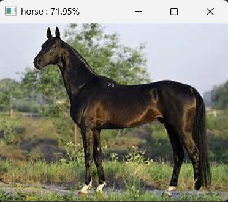

# Dự án Phân loại Hình ảnh sử dụng EfficientNet-B0

Đây là một dự án đầy đủ để huấn luyện và kiểm thử một mô hình phân loại hình ảnh (Computer Vision) sử dụng thư viện PyTorch. Dự án áp dụng kỹ thuật **Transfer Learning** với mô hình **EfficientNet-B0** đã được huấn luyện trước (pre-trained) trên bộ dữ liệu ImageNet.

## 🚀 Các Tính năng Chính

* **Mô hình Hiện đại**: Sử dụng EfficientNet-B0, một mô hình mạnh mẽ và hiệu quả.
* **Transfer Learning**: Tinh chỉnh (fine-tuning) mô hình đã được huấn luyện trước để đạt hiệu suất cao với bộ dữ liệu tùy chỉnh.
* **Pipeline Hoàn chỉnh**: Cung cấp mã nguồn cho toàn bộ quy trình:
    * `dataset.py`: Định nghĩa lớp `Dataset` tùy chỉnh.
    * `model.py`: Định nghĩa kiến trúc mô hình.
    * `train_cnn.py`: Script để huấn luyện, đánh giá và lưu trữ mô hình.
    * `test_cnn.py`: Script để chạy dự đoán trên một ảnh đơn lẻ.
* **Tăng cường Dữ liệu (Data Augmentation)**: Sử dụng các kỹ thuật augmentation mạnh mẽ (xoay, dịch, phóng to/thu nhỏ, bẻ xiên, và điều chỉnh màu sắc) để cải thiện độ chính xác.
* **Theo dõi (Logging)**: Tích hợp **TensorBoard** để theo dõi `train_loss`, `val_accuracy`, và hiển thị **Confusion Matrix** (Ma trận Nhầm lẫn) sau mỗi epoch.
* **Checkpointing**: Tự động lưu lại mô hình có độ chính xác tốt nhất (`best_cnn.pt`) và mô hình của epoch cuối cùng (`last_cnn.pt`). Hỗ trợ khả năng huấn luyện tiếp (resume training) từ một checkpoint.

## 📁 Cấu trúc Thư mục

```
.
├── data/                    # Thư mục chứa dữ liệu huấn luyện (mỗi lớp 1 thư mục con)
│   ├── class_1/
│   └── class_2/
├── demo/                    # Chứa các ảnh dùng để test (demo)
│   └── test_img/
│       └── cavallo/
│           └── house_1.jpeg
├── tensorboard/            # (MỚI) Thư mục chứa các ảnh minh họa kết quả
│   ├── train_Loss.png
│   ├── val_Accracy.png
│   └── Confusion_matrix.png
├── trained_models/          # Thư mục (tự động tạo) để lưu các model đã huấn luyện
│   ├── best_cnn.pt
│   └── last_cnn.pt
├── tensorboard_file/        # Thư mục (tự động tạo) để lưu file log của TensorBoard
├── dataset.py               # Định nghĩa lớp AnimalDataset
├── model.py                 # Định nghĩa mô hình EfficientNetClassifier
├── train_cnn.py             # Script huấn luyện
├── test_cnn.py              # Script kiểm thử (inference)
└── requirements.txt         # File chứa các thư viện cần thiết
```

## 📊 Kết quả Huấn luyện (Minh họa)

Dưới đây là một số kết quả minh họa được trích xuất từ TensorBoard trong quá trình huấn luyện.

**1. Đồ thị Train Loss**
*Đồ thị cho thấy giá trị loss trên tập huấn luyện giảm dần qua các epoch, cho thấy mô hình đang học tốt.*


**2. Đồ thị Validation Accuracy**
*Đồ thị cho thấy độ chính xác trên tập validation tăng dần, thể hiện khả năng tổng quát hóa của mô hình trên dữ liệu mới.*


**3. Ma trận Nhầm lẫn (Confusion Matrix)**
*Ma trận nhầm lẫn từ epoch cuối cùng, cho thấy hiệu suất của mô hình trên từng lớp cụ thể. Đường chéo chính càng rõ nét thì mô hình phân loại càng chính xác.*


## 🚀 Demo Dự đoán

